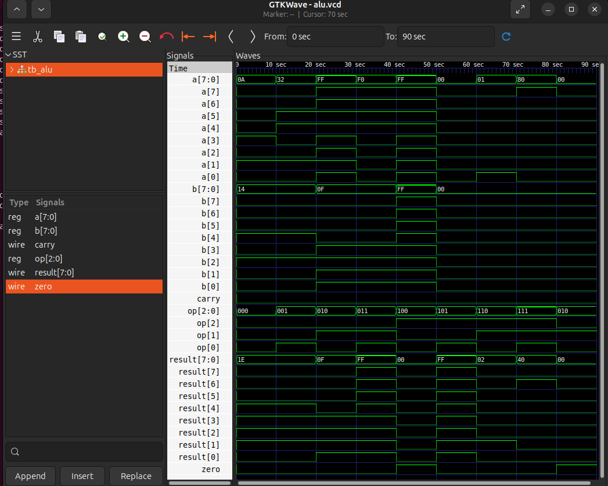
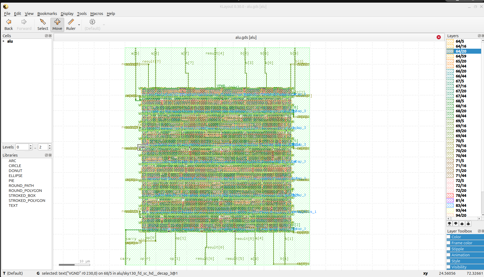

# 8-bit ALU — RTL to GDSII on SkyWater SKY130

A fully verified 8-bit Arithmetic Logic Unit implemented in Verilog and taken through complete RTL-to-GDSII physical design flow using open-source EDA tools on SkyWater SKY130 130nm PDK.

---

## Supported Operations

| Opcode | Operation | Description |
|--------|-----------|-------------|
| `000`  | ADD       | `{carry, result} = a + b` |
| `001`  | SUB       | `{carry, result} = a - b` |
| `010`  | AND       | `result = a & b` |
| `011`  | OR        | `result = a \| b` |
| `100`  | XOR       | `result = a ^ b` |
| `101`  | NOT       | `result = ~a` |
| `110`  | LSHIFT    | `result = a << 1` |
| `111`  | RSHIFT    | `result = a >> 1` |

**Flags:**
- `zero` — asserted when result == 0
- `carry` — asserted on ADD/SUB overflow

---

## Toolchain

| Step | Tool |
|------|------|
| RTL Simulation | Icarus Verilog (iverilog) |
| Waveform Debug | GTKWave |
| Logic Synthesis | Yosys 0.52 |
| Physical Design | OpenLane 2 |
| Place & Route | OpenROAD |
| Static Timing Analysis | OpenSTA |
| DRC / LVS | Magic + Netgen |
| GDSII Viewer | KLayout |
| PDK | SkyWater SKY130 (130nm) |

---

## Synthesis Results (Yosys)

| Metric | Value |
|--------|-------|
| Total Cells | 247 |
| Total Wires | 243 |
| AND | 9 |
| OR | 74 |
| XOR | 12 |
| NOT | 6 |
| NOR | 27 |
| NAND | 4 |
| MUX | 9 |
| ANDNOT / ORNOT | 87 / 9 |
| Flip Flops | 0 (combinational design) |
| DRC Violations | 0 |

---

## Simulation Waveform



The waveform shows all 8 operations verified sequentially:
- `op=000` ADD: `0x0A + 0x14 = 0x1E`
- `op=001` SUB: `0x32 - 0x0F = 0x0F` (with carry flag)
- `op=010` AND: `0xFF & 0xFF = 0xFF`
- `op=011` OR:  `0xF0 | 0x00 = 0xF0`
- `op=100` XOR: `0xFF ^ 0xFF = 0x00` (zero flag asserted)
- `op=101` NOT: `~0x00 = 0xFF`
- `op=110` LSHIFT: `0x01 << 1 = 0x02`
- `op=111` RSHIFT: `0x80 >> 1 = 0x40`

---

## Gate-level Schematic (Yosys)


---

## GDSII Layout (KLayout — SKY130)



---

## Project Structure

```
alu_project/
├── src/
│   └── alu.v           # RTL design
├── tb/
│   └── tb_alu.v        # Testbench
├── synth/
│   └── synth.ys        # Yosys synthesis script
├── openlane/
│   └── config.json     # OpenLane configuration
├── images/
│   ├── waveform.png    # GTKWave simulation output
│   ├── schematic.png   # Yosys gate-level schematic
│   └── gds_layout.png  # KLayout GDSII screenshot
└── README.md
```

---

## How to Simulate

```bash
iverilog -o alu_sim src/alu.v tb/tb_alu.v
vvp alu_sim
gtkwave alu.vcd
```

## How to Synthesize

```bash
yosys -p "read_verilog src/alu.v; synth -top alu; stat"
```

## Physical Design (OpenLane)

```bash
./flow.tcl -design alu
```

Full flow: synthesis → floorplan → placement → CTS → routing → DRC → LVS → GDSII

---

## Resume Line

> Implemented an 8-bit ALU with 8 operations through complete RTL-to-GDSII flow on SkyWater SKY130 130nm PDK using Yosys + OpenLane + OpenROAD, achieving DRC/LVS clean layout — 247 cells, zero timing violations.

---

## Tags

`vlsi` `verilog` `rtl-design` `openlane` `sky130` `physical-design` `gdsii` `yosys` `openroad` `alu`
